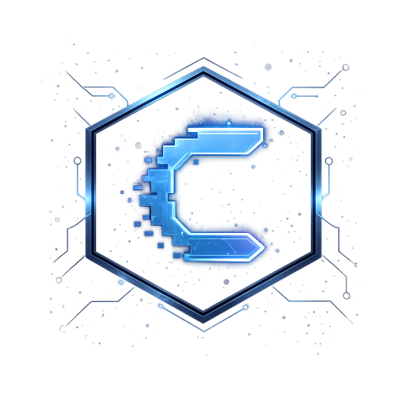

  

<h1 align="center">Codex Hackathons</h1>

  <strong>Self-hosted hackathon operations for teams that need real control, real workflows, and repeatable event execution.</strong>

  Run applications, teams, submissions, judging, winners, prizes, galleries, feedback, and event operations from one platform on infrastructure you control.

  <a href="docs/domain-model.md">Product Model</a>
  |
  <a href="docs/lifecycle-and-state-machines.md">Lifecycle</a>
  |
  <a href="docs/permissions-matrix.md">Permissions</a>
  |
  <a href="docs/tech-stack.md">Stack</a>
  |
  <a href="DEVELOPMENT.md">Development</a>

  
  
  
  

  

---

## Built For Serious Hackathon Programs

Codex Hackathons is for organizations that have outgrown forms, spreadsheets, manual judge sheets, event-tool exports, email threads, and one-off admin scripts. It gives community, developer-relations, research, accelerator, and internal innovation teams one operating system for recurring or parallel hackathons.

<table>
  <tr>
    <td width="33%">
      <strong>Own the full event lifecycle</strong> 
      Manage applications, approvals, teams, submissions, judging, winners, prizes, galleries, and post-event feedback without stitching tools together.
    </td>
    <td width="33%">
      <strong>Operate multiple hackathons</strong> 
      Users keep reusable platform accounts while each hackathon has its own schedule, rules, roles, terms, teams, submissions, judging, and outcomes.
    </td>
    <td width="33%">
      <strong>Keep control of the data</strong> 
      Run the platform in your own Cloudflare and Auth0 environment, with authorization and competition state owned by the application data model.
    </td>
  </tr>
</table>

## Why Teams Choose It

| Capability | What operators get |
| --- | --- |
| **Application-first participation** | Per-hackathon registration windows, profile requirements, application terms, approvals, participant decision emails, and optional Luma attendance integration. |
| **Built-in team workflows** | Solo participation, team creation, join requests, team admins, team limits, and account-scoped team workspaces. |
| **Structured submissions** | Submission windows, tracks, summaries, repository links, demo links, drafts, locking, withdrawal, and disqualification handling. |
| **Serious judging** | Blind review, judge assignment, skipped-review redistribution, shortlist management, live pitch stages, pitch review, weighted scoring, and final deliberation. |
| **Outcome operations** | Winner announcements, prize eligibility snapshots, winner emails, winner terms, legal-name collection, prize redemption tracking, and completed public showcases. |
| **Clear permission boundaries** | Platform admins, hackathon admins, staff, judges, approved participants, team admins, and prize recipients are separate actors with explicit platform-data permissions. |
| **Post-event learning** | Anonymous feedback collection after completion, with results available to the operating team. |

## What The Platform Covers

<table>
  <tr>
    <th align="left">Public and participant experience</th>
    <th align="left">Organizer operations</th>
    <th align="left">Competition and outcomes</th>
  </tr>
  <tr>
    <td valign="top">
      Public hackathon pages, schedules, tracks, prizes, registration, account onboarding, reusable profiles, application status, team formation, submissions, galleries, credits, shortlist visibility, and completed outcomes.
    </td>
    <td valign="top">
      Platform-admin and hackathon-admin workflows, staff and judge assignments, staged application review, participant-facing emails, lifecycle controls, operational sync, audit-ready retention, and role-specific workspaces.
    </td>
    <td valign="top">
      Team-owned submissions, blind and pitch scoring, finalist boundaries, final ranking, prizes, winner communications, prize redemption, public winner showcases, published projects, galleries, and feedback reporting.
    </td>
  </tr>
</table>

---

## Operating Model

You run Codex Hackathons in infrastructure you control. Auth0 owns authentication. Codex Hackathons owns authorization: platform roles, hackathon roles, team roles, application state, judging assignments, prize eligibility, and event operations live in platform data.

  

The canonical deployment model uses:

| Layer | Role |
| --- | --- |
| **Cloudflare Workers** | Application hosting and server-side execution. |
| **Cloudflare D1** | Primary relational database. |
| **Cloudflare R2** | Profile icons, hackathon imagery, and gallery storage. |
| **Cloudflare Images bindings** | Protected gallery preview transformations. |
| **Cloudflare Queues** | Asynchronous email and Luma sync jobs. |
| **Cloudflare Email Service** | Outbound transactional email delivery. |
| **Cloudflare Cron Triggers** | Scheduled platform work. |
| **Auth0** | User authentication and linked identity resolution. |
| **Luma** | Optional event guest verification, approval/rejection sync, and attendance webhooks. |

The repository includes automation for the parts that should not be hand-maintained forever:

- Auth0 tenant drift checks and bootstrap commands for required app URLs, branding, custom domains, Actions, and account-linking callbacks.
- First-platform-admin bootstrap commands.
- Luma webhook reconciliation for environments that enable Luma sync.
- Cloudflare queue, secret, migration, and deployment workflows.
- A GitHub Release driven production deployment workflow.

## Good Fit

Codex Hackathons is a good fit when your team needs to:

- run multiple hackathons from the same platform;
- review and approve participants before they enter the workspace;
- support solo builders and teams without separate tooling;
- run blind judging, live pitches, or both;
- keep admin, staff, judge, participant, and winner permissions explicit;
- host on Cloudflare with your own Auth0 tenant and deployment pipeline;
- keep participant data, competition state, and prize operations in one auditable system.

It is probably more platform than you need if you only want a single static event page, an RSVP form, or an unstructured showcase gallery.

## What Operators Need To Provide

An adopter should plan for:

- a Cloudflare account with Workers, D1, R2, Images, Queues, Cron Triggers, DNS, Email Sending on a Workers Paid plan, and appropriate API tokens;
- an Auth0 tenant and Regular Web Application for the platform;
- an onboarded Cloudflare Email Service sending domain and verified sender address;
- production and, if desired, shared development domains;
- optional Luma API access when hackathons use Luma guest sync or attendance webhooks;
- operational owners who can manage platform admins, hackathon admins, judges, staff, and release access.

Environment-specific values are documented through [`.env.example`](.env.example), [`wrangler.jsonc`](wrangler.jsonc), and [`DEVELOPMENT.md`](DEVELOPMENT.md). The root README intentionally stays at the adopter and operator level rather than listing every runtime variable.

---

## Product Documentation

The canonical product and engineering docs live in [`docs/`](docs/README.md). Start here when evaluating exact behavior:

| Document | Purpose |
| --- | --- |
| [`docs/domain-model.md`](docs/domain-model.md) | Entities, relationships, permissions, and business invariants. |
| [`docs/lifecycle-and-state-machines.md`](docs/lifecycle-and-state-machines.md) | Hackathon, application, team, submission, judging, winner, and redemption lifecycles. |
| [`docs/permissions-matrix.md`](docs/permissions-matrix.md) | Actor permissions, visibility rules, and state-based action constraints. |
| [`docs/schema-outline.md`](docs/schema-outline.md) | Canonical fields, enums, constraints, and key relationships. |
| [`docs/api-surface.md`](docs/api-surface.md) | Backend API domains, operations, contract conventions, and validation expectations. |
| [`docs/tech-stack.md`](docs/tech-stack.md) | Application stack and infrastructure choices. |
| [`docs/testing-strategy.md`](docs/testing-strategy.md) | Validation layers and Auth0-backed end-to-end strategy. |

For repository contributors, local development, test commands, and release mechanics, use [`DEVELOPMENT.md`](DEVELOPMENT.md).
