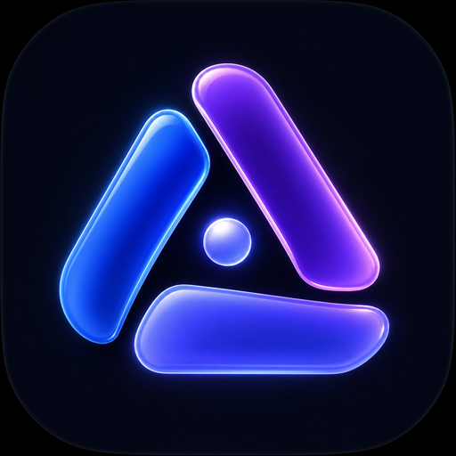
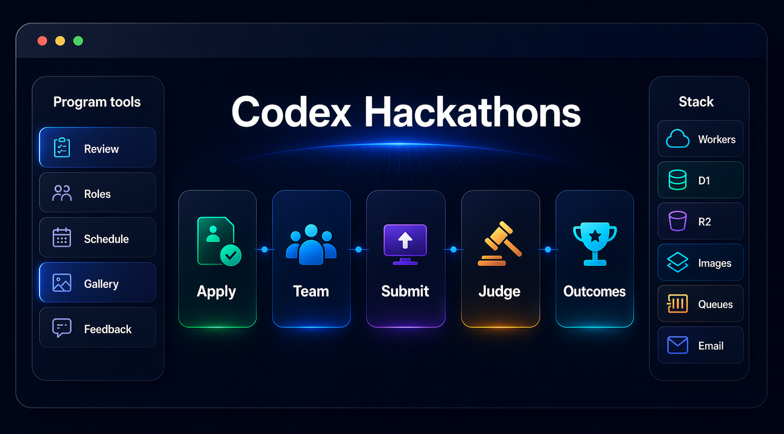
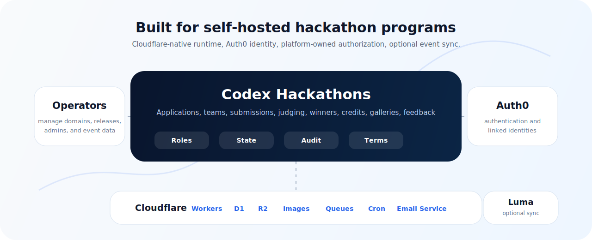

  

<h1 align="center">Codex Events</h1>

  <strong>A self-hosted event workspace for teams that want clear paths from registration to results.</strong>

  Coordinate applications, teams, submissions, judging, winners, prizes, galleries, and feedback from one place, on infrastructure you choose.

  <a href="docs/domain-model.md">Product Model</a>
  |
  <a href="docs/lifecycle-and-state-machines.md">Lifecycle</a>
  |
  <a href="docs/permissions-matrix.md">Permissions</a>
  |
  <a href="docs/tech-stack.md">Stack</a>
  |
  <a href="OPERATOR.md">Operator Guide</a>
  |
  <a href="DEVELOPMENT.md">Development</a>

  
  
  
  

  Platform overview 
  

---

## A Shared Workspace For Events

Codex Events helps teams replace scattered forms, spreadsheets, judge sheets, event-tool exports, email threads, and one-off scripts with a shared workspace for recurring or parallel events.

<table>
  <tr>
    <td width="33%">
      <strong>Keep each event understandable</strong> 
      Manage applications, approvals, teams, submissions, judging, winners, prizes, galleries, and post-event feedback without stitching tools together.
    </td>
    <td width="33%">
      <strong>Reuse the same foundation</strong> 
      Users keep reusable platform accounts while each event has its own schedule, rules, roles, terms, teams, submissions, judging, and outcomes.
    </td>
    <td width="33%">
      <strong>Choose where it runs</strong> 
      Deploy the platform in your Cloudflare and Auth0 environment, with authorization and competition state stored in the application data model.
    </td>
  </tr>
</table>

## What It Helps With

| Capability | How it helps |
| --- | --- |
| **Application-first participation** | Per-event registration windows, profile requirements, application terms, approvals, participant decision emails, and optional Luma attendance integration. |
| **Built-in team workflows** | Solo participation, team creation, join requests, team admins, team limits, and account-scoped team workspaces. |
| **Structured submissions** | Submission windows, tracks, summaries, repository links, demo links, drafts, locking, withdrawal, and disqualification handling. |
| **Structured judging** | Blind review, judge assignment, skipped-review redistribution, shortlist management, live pitch stages, pitch review, weighted scoring, and final deliberation. |
| **Outcomes and follow-through** | Winner announcements, prize eligibility snapshots, winner emails, winner terms, legal-name collection, prize redemption tracking, and completed public showcases. |
| **Clear permission boundaries** | Platform admins, event admins, staff, judges, approved participants, team admins, and prize recipients are separate actors with explicit platform-data permissions. |
| **Post-event learning** | Anonymous feedback collection after completion, with results available to the operating team. |

## What The Platform Covers

<table>
  <tr>
    <th align="left">Public and participant experience</th>
    <th align="left">Organizer workflows</th>
    <th align="left">Competition and outcomes</th>
  </tr>
  <tr>
    <td valign="top">
      Public event pages, schedules, tracks, prizes, registration, account onboarding, reusable profiles, application status, team formation, submissions, galleries, credits, shortlist visibility, and completed outcomes.
    </td>
    <td valign="top">
      Platform-admin and event-admin workflows, staff and judge assignments, staged application review, participant-facing emails, lifecycle transitions, event sync, durable records, and role-specific workspaces.
    </td>
    <td valign="top">
      Team-owned submissions, blind and pitch scoring, finalist boundaries, final ranking, prizes, winner communications, prize redemption, public winner showcases, published projects, galleries, and feedback reporting.
    </td>
  </tr>
</table>

---

## How It Runs

Codex Events runs in infrastructure you choose. Auth0 handles authentication. The platform handles authorization: platform roles, event roles, team roles, application state, judging assignments, prize eligibility, and event history live in platform data.

  

The platform deployment uses:

| Layer | Role |
| --- | --- |
| **Cloudflare Workers** | Application hosting and server-side execution. |
| **Cloudflare D1** | Primary relational database. |
| **Cloudflare R2** | Profile icons, event imagery, and gallery storage. |
| **Cloudflare Images bindings** | Protected gallery preview transformations. |
| **Cloudflare Queues** | Asynchronous email and Luma sync jobs. |
| **Cloudflare Email Service** | Outbound transactional email delivery. |
| **Cloudflare Cron Triggers** | Scheduled platform work. |
| **Auth0** | User authentication and linked identity resolution. |
| **Luma** | Optional event guest verification, approval/rejection sync, and attendance webhooks. |

The repository includes automation for recurring setup and maintenance:

- Auth0 setup for required app URLs, branding, custom domains, Actions, and account-linking callbacks.
- First platform-admin setup.
- Luma webhook setup for environments that enable Luma sync.
- Cloudflare queue, secret, migration, and deployment workflows.
- A GitHub Release driven production deployment workflow.

Remote test and production deployments are generated from environment-specific deployment variables, Cloudflare IDs, and runtime settings. Local Cloudflare bindings are documented in `wrangler.jsonc`.

## Where It Fits

Codex Events is a good fit when your team wants to:

- run multiple events from the same platform;
- review and approve participants before they enter the workspace;
- support solo builders and teams without separate tooling;
- run blind judging, live pitches, or both;
- keep admin, staff, judge, participant, and winner permissions explicit;
- host on Cloudflare with your own Auth0 tenant and deployment pipeline;
- keep participant data, competition state, and prize follow-up in one consistent record.

It may be more than you need if you only want a single static event page, an RSVP form, or an unstructured showcase gallery.

## What You Bring

Plan for:

- a Cloudflare account with Workers, D1, R2, Images, Queues, Cron Triggers, DNS, Email Sending on a Workers Paid plan, and appropriate API tokens;
- an Auth0 tenant and Regular Web Application for the platform;
- an onboarded Cloudflare Email Service sending domain and verified sender address;
- production and, if desired, test domains;
- optional Luma API access when events use Luma guest sync or attendance webhooks;
- deployment-owned legal controller details, support and privacy contact addresses, and current Privacy Policy and Platform Terms content;
- people who can manage platform admins, event admins, judges, staff, and release access.

Before launch, configure platform legal settings and publish current platform documents from the platform-admin workspace or legal setup tooling. Public legal pages and account registration require those settings to be present.

Production setup, advanced deployment overrides, the optional test environment, and tuning settings are documented in [`OPERATOR.md`](OPERATOR.md). Environment-specific examples are available in [`.env.example`](.env.example), and local Cloudflare bindings are shown in [`wrangler.jsonc`](wrangler.jsonc).

---

## Product Documentation

The canonical product and engineering docs live in [`docs/`](docs/README.md). Start here when evaluating exact behavior:

| Document | Purpose |
| --- | --- |
| [`docs/domain-model.md`](docs/domain-model.md) | Entities, relationships, permissions, and business invariants. |
| [`docs/lifecycle-and-state-machines.md`](docs/lifecycle-and-state-machines.md) | Event, application, team, submission, judging, winner, and redemption lifecycles. |
| [`docs/permissions-matrix.md`](docs/permissions-matrix.md) | Actor permissions, visibility rules, and state-based action constraints. |
| [`docs/schema-outline.md`](docs/schema-outline.md) | Canonical fields, enums, constraints, and key relationships. |
| [`docs/api-surface.md`](docs/api-surface.md) | Backend API domains, operations, contract conventions, and validation expectations. |
| [`docs/tech-stack.md`](docs/tech-stack.md) | Application stack and infrastructure choices. |
| [`docs/testing-strategy.md`](docs/testing-strategy.md) | Validation layers and Auth0-backed end-to-end strategy. |

For teams running the platform, use [`OPERATOR.md`](OPERATOR.md). For repository contributors, local development, test commands, and release mechanics, use [`DEVELOPMENT.md`](DEVELOPMENT.md).
